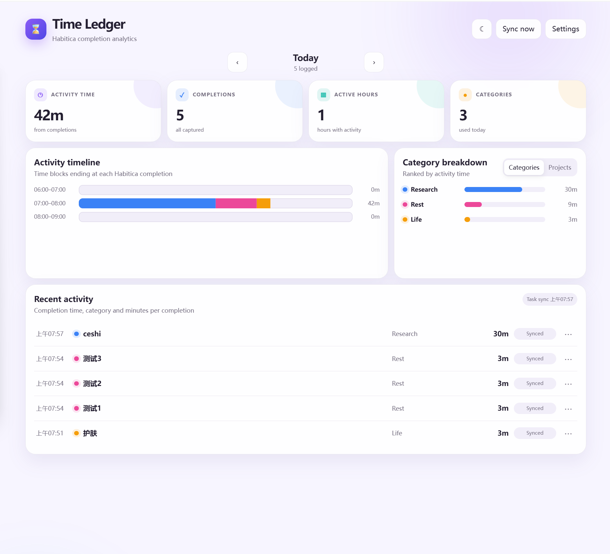

# Habitica Time Ledger

**Turn Habitica completions into an activity timeline, category breakdowns, and project analytics — without running a separate timer.**



> **Beta:** Habitica Time Ledger is currently distributed as a manually installed Chrome extension. A Chrome Web Store release is planned after broader testing.

## What it does

Habitica is excellent for completing tasks and building routines, but it does not show where your day went. Time Ledger adds that missing analytics layer while keeping Habitica as your only task interface.

Complete a Habit, Daily, or To-Do in Habitica as usual. Time Ledger captures the completion, applies the category, project, and minutes configured for that task, and places the resulting activity block on a daily timeline.

## Features

- Automatic capture of Habitica web completions
- Hour-by-hour activity timeline
- Category and project breakdowns
- Recent completion history
- Per-task category, project, and minutes configuration
- Reusable setup templates for deleted and recreated tasks
- Shared setup for numbered task variants such as `Project 1`, `Project 2`, and `Project 3`
- Light and dark themes
- Sync recovery for missed Daily and To-Do changes
- Local-only storage with no external analytics server

## How it works

1. Connect the extension with your Habitica User ID and API Token.
2. Sync your Habitica tasks.
3. Configure each task once:
   - **Category**
   - **Project**
   - **Minutes per completion**
4. Use Habitica normally.
5. Open the dashboard to review your activity timeline and breakdowns.

Time Ledger does **not** run a stopwatch. The configured minutes represent the activity time associated with each completion. The completion timestamp determines where that activity appears on the daily timeline.

## Installation from source

1. Download or clone this repository.
2. Open `chrome://extensions` in Chrome.
3. Enable **Developer mode**.
4. Click **Load unpacked**.
5. Select the project folder containing `manifest.json`.
6. Open Time Ledger settings and connect your Habitica account.
7. Refresh the Habitica website after installing or updating the extension.

## Habitica credentials

Your credentials are available in Habitica under:

**Settings → Site Data → API**

Treat your API Token like a password. Never include it in screenshots, GitHub issues, commits, or shared configuration files.

## Repeated and recreated tasks

Habitica assigns a new task ID when a To-Do is deleted and recreated. Time Ledger also remembers setup by normalized task name, allowing a recreated task to inherit its earlier category, project, and minutes after the next sync.

When **Apply to similar names** is enabled, numbered variants can share one template:

```text
Project 1
Project 2
Project 3
```

The same applies to series such as `Application 1`, `Application 2`, and so on.

## Capture methods

- **Web exact:** Captures successful Habitica score requests and records the web completion time.
- **DOM fallback:** Observes task-control clicks when the network observer is unavailable.
- **Sync recovery:** Compares current task states with the previous snapshot and restores missed Daily or To-Do changes.

## Privacy

Time Ledger does not operate an external server.

- Credentials, task setup, and activity records are stored in Chrome local storage.
- Habitica credentials are sent only to Habitica's official API when syncing.
- No data is sold, shared with advertisers, or used for cross-site tracking.

See [PRIVACY.md](PRIVACY.md) for the complete policy.

## Current limitations

- Exact completion timestamps are captured primarily from the Habitica website.
- Mobile completions may be recovered during sync, but the original completion time may not always be available.
- Activity time is based on configured minutes per completion rather than stopwatch measurements.
- The extension is currently optimized for Chrome and other Chromium-based browsers.

## Development status

Current version: **0.5.1 beta**

Planned next steps:

- broader browser testing
- clearer mobile-sync handling
- permission minimization for store review
- Chrome Web Store beta release

See [CHANGELOG.md](CHANGELOG.md) for version history.

## Contributing

Bug reports and suggestions are welcome through GitHub Issues. Remove all Habitica credentials and personal task details before sharing screenshots or logs.

See [CONTRIBUTING.md](CONTRIBUTING.md) for development and reporting guidance.

## Disclaimer

Habitica Time Ledger is an independent, unofficial companion extension. It is not affiliated with, endorsed by, or maintained by Habitica.

## License

Released under the [MIT License](LICENSE).
